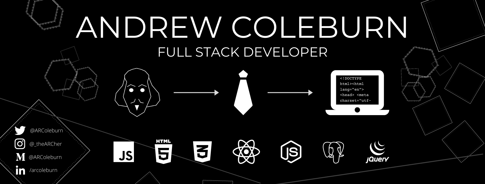

## Hey There! I'm Andrew Coleburn.
---
### About Me
Shakespearean Actor, turned Management Consultant, turned Software Developer. Quite the combo, I know. 

*Here's the story:* 

I'm a former theatre kid who got halfway through an MFA in Acting before deciding against a life in show business. Since then, I've finished a Masters in Theatre, worked as a consultant in NYC, joined a talent-aquisition firm in Raleigh, NC, and found the time to start teaching myself how to code.

Spending 10 hours a day cold-calling potential job seekers made me realize I wanted to do work that resulted in actually making something. So I enrolled as a student in the Thinkful Engineering Immersion program, to learn how to make kick-ass software.

Currently, I'm working as a Developer and Consultant for Bitovi. 

----
### :black_nib: Writing

I don't only write software, I write other stuff too. Most of that is over on [Medium.](https://arcoleburn.medium.com/)

---
### :hammer: Currently Building

- BugBook Journal
    - [Server](https://github.com/arcoleburn/bugbook-server)
    - [Client](https://github.com/arcoleburn/bugbook-client)
    - [Live App](https://bugbookjournal.com)

- 253trades 
    - [Market Calender API](https://github.com/arcoleburn/marketCalendarAPI)
    - BTC/STO Backtester :shushing_face:
    
- Meet4
    - [Live App](https://meet4.xyz)
    - [Client](https://github.com/arcoleburn/meet4-client)
    - [Server](https://github.com/arcoleburn/meet4-server)

- Covid-19 Vaccine Roll Out API
    - [API and Docs](https://github.com/arcoleburn/covid-API)

You can check out my older project repos below, like the [Shakespeare Quiz](https://arcoleburn.github.io/ACRSQuizApp/) and [Hippo](https://arcoleburn.github.io/bookmarks-app/).

---
### :nerd_face: Currently Learning
- React  (with hooks!)
- Styled Components
- Bootstrap
- Express 
- JavaScript. Always. 

<!--
**arcoleburn/arcoleburn** is a ✨ _special_ ✨ repository because its `README.md` (this file) appears on your GitHub profile.

Here are some ideas to get you started:

- 🔭 I’m currently working on ...
- 🌱 I’m currently learning ...
- 👯 I’m looking to collaborate on ...
- 🤔 I’m looking for help with ...
- 💬 Ask me about ...
- 📫 How to reach me: ...
- 😄 Pronouns: ...
- ⚡ Fun fact: ...
-->
